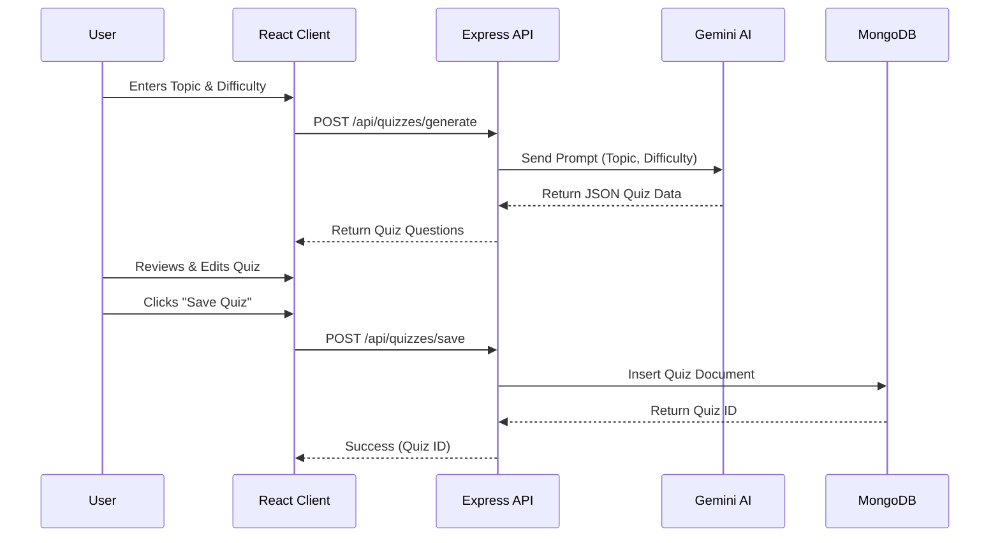
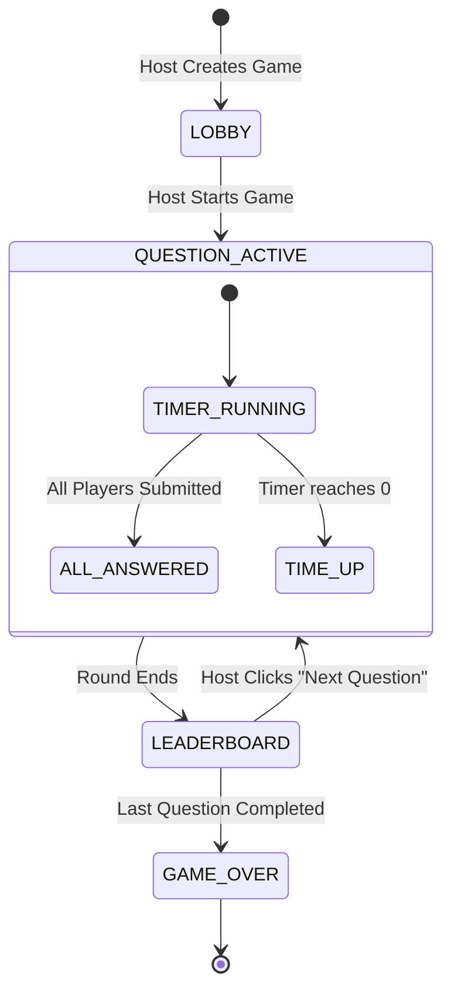

# System Diagrams

## 1. Sequence Diagram: Generating a Quiz
This diagram illustrates the flow when a user requests a new AI-generated quiz.

## 2. State Diagram: Game States
This diagram shows the lifecycle of a game session managed by the Socket.io server.

